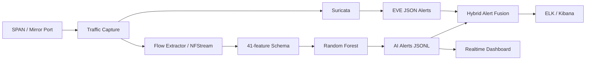

# Hybrid-NIDS: Suricata + Random Forest Network Intrusion Detection

> A hybrid Network Intrusion Detection System (Hybrid-NIDS) combining signature-based detection (Suricata) with flow-based machine learning detection (Random Forest).

[]()
[]()
[]()

---

## Introduction

**Hybrid-NIDS** is the source code supporting an applied master's thesis project on a hybrid network intrusion detection system, combining two **independent** detection branches:

- **Suricata** — signature/rule-based detection.
- **Random Forest** — detection based on network flow features (flow-based machine learning).

Alerts from the two branches are **fused (correlated)** within a time window and forwarded to the **ELK Stack/Kibana** for monitoring, analysis, and demonstration in a lab environment.

> **Note:** This repository has been cleaned for public release on GitHub. The virtual environment, the large UNSW-NB15 dataset, real PCAP captures, operational logs, and any files containing deployment secrets are **not** included in the repo.

---

## Table of Contents

- [Overall Architecture](#overall-architecture)
- [Key Features of the Codebase](#key-features-of-the-codebase)
- [Official Model Results](#official-model-results)
- [Repository Structure](#repository-structure)
- [Environment Requirements](#environment-requirements)
- [Quick Installation](#quick-installation)
- [Post-Installation Checks](#post-installation-checks)
- [Running AI Inference on Sample Data](#running-ai-inference-on-sample-data)
- [Running the Real-Time Dashboard](#running-the-real-time-dashboard)
- [Suricata + AI Alert Fusion](#suricata--ai-alert-fusion)
- [Dataset and Reproducing Results](#dataset-and-reproducing-results)
- [PCAP / Live Traffic](#pcap--live-traffic)
- [Ubuntu + ELK Deployment](#ubuntu--elk-deployment)
- [Secrets Security](#secrets-security)
- [Key Documentation](#key-documentation)
- [Intended Use](#intended-use)
- [License Note](#license-note)

---

## Overall Architecture



At the collection layer, the same traffic source is observed via a SPAN/mirror port. At the detection layer, Suricata and Random Forest operate as two independent mechanisms. The `hybrid_alert_fusion.py` module performs **alert correlation**, rather than merging the two branches into a single classifier.

---

## Key Features of the Codebase

- Random Forest with a preprocessing pipeline for both numerical and categorical data.
- Official schema of **41 features**, comprising 35 numerical features and 6 categorical features.
- **Development/Hold-out** split by feature hash to limit overlap between sets.
- **Group-aware Stratified 5-Fold Cross Validation** for classification threshold selection.
- Leakage checks, inference benchmarking, feature importance analysis, and confusion matrix reporting.
- Fusion of Suricata + AI alerts into `HYBRID_CORRELATED_ALERT`, `AI_ONLY_ALERT`, and `SURICATA_ONLY_ALERT`.
- Real-time replay dashboard for demonstrations.
- Ubuntu deployment scripts covering systemd, Logstash, ILM, logrotate, and time synchronization checks.
- SHA-256 integrity verification before loading pickle/joblib models from a trusted artifact directory.

---

## Official Model Results

> The values below are taken from `models/metrics.json` in this repository.

| Metric | Result |
|---|---|
| Accuracy | 0.992768 |
| Balanced Accuracy | 0.984698 |
| Precision | 0.968823 |
| Recall | 0.973911 |
| F1-score | 0.971360 |
| False Positive Rate | 0.004515 |
| False Negative Rate | 0.026089 |
| ROC-AUC | 0.999671 |
| Threshold | 0.870846 |
| Hold-out test size | 508,039 flows |

**Confusion matrix (hold-out test set):**

| | Predicted Negative | Predicted Positive |
|---|---|---|
| **Actual Negative** | TN = 442,060 | FP = 2,005 |
| **Actual Positive** | FN = 1,669 | TP = 62,305 |

Leakage check results are stored in `models/leakage_check.json`: `duplicate_hash_count = 0` and `is_pass = true`.

---

## Repository Structure

```text
HYBRID-NIDS/
├── README.md
├── requirements.txt
├── requirements-optional.txt
├── train_model.py                 # Official model training
├── nids_detector.py               # AI inference on flow CSV / PCAP integration
├── nids_features.py               # Flow feature extraction
├── hybrid_alert_fusion.py         # Suricata + AI alert fusion
├── realtime_dashboard.py          # Real-time replay dashboard
├── hybrid_nids_webpanel.py        # Web control panel for the lab
├── verify_official_artifacts.py   # Full artifact set verification
├── verify_model_artifacts_security.py
├── benchmark_inference.py
├── analyze_schema_gap.py
├── analyze_feature_drift.py
├── analyze_ttl_features.py
├── evaluate_artifacts.py
├── evaluate_local_traffic.py
├── sample_flows.csv               # Small sample for quick inference testing
├── models/                        # Model + metrics + schema + figures
├── data/                          # Small sample/metadata only
├── logs/                          # Sample logs for fusion testing only
├── docs/                          # Technical documentation and reproduction guides
├── deployment/                    # systemd, ELK, logrotate, env.example
├── scripts/                       # Lab/deployment scripts
├── labeling/                      # Attack-window labeling samples
├── evidence_screenshots/          # Testing/experiment evidence
└── tools/                         # Documentation/thesis support utilities
```

The list of artifacts locked for the thesis is maintained in `OFFICIAL_ARTIFACTS.md` and `docs/CODEBASE_LOCK.md`.

---

## Environment Requirements

### Python

**Python 3.12 or 3.13** is recommended. The current model artifact was built with:

| Component | Version |
|---|---|
| Python | 3.13.9 |
| scikit-learn | 1.6.1 |
| pandas | 2.3.3 |
| NumPy | 2.3.5 |

> `scikit-learn` is **pinned** to version `1.6.1` in `requirements.txt` to reduce the risk of incompatibility when deserializing the model.

### Operating System

| OS | Suitable for |
|---|---|
| **Windows** | Training, evaluation, CSV replay, and dashboard |
| **Ubuntu/Linux** | PCAP capture, NFStream, Suricata, systemd, and ELK deployment |

---

## Quick Installation

### Windows PowerShell

```powershell
git clone https://github.com/<YOUR-USERNAME>/hybrid-nids.git
cd hybrid-nids

py -3.13 -m venv .venv
.\.venv\Scripts\Activate.ps1
python -m pip install --upgrade pip
pip install -r requirements.txt
```

### Ubuntu/Linux

```bash
git clone https://github.com/<YOUR-USERNAME>/hybrid-nids.git
cd hybrid-nids

python3 -m venv .venv
source .venv/bin/activate
python -m pip install --upgrade pip
pip install -r requirements.txt
```

Utilities outside the main pipeline (e.g. XGBoost comparison or DOCX editing tools) can be installed additionally with:

```bash
pip install -r requirements-optional.txt
```

---

## Post-Installation Checks

**1. Schema/extractor smoke test**

```bash
python smoke_test_schema.py
```

Expected output:

```text
[+] Smoke test schema/extractor OK.
```

**2. Model integrity verification**

```bash
python verify_model_artifacts_security.py
```

This script checks whether the model resides in a trusted directory and whether its SHA-256 hash matches the metadata before use.

> ⚠️ **Do not load** `.pkl`/`.joblib` files from untrusted sources. Pickle/joblib can execute arbitrary code during deserialization.

---

## Running AI Inference on Sample Data

The repo ships with `sample_flows.csv` for a quick test:

```bash
python nids_detector.py \
  --input-csv sample_flows.csv \
  --once \
  --output-log logs/ai_alerts.jsonl \
  --disable-discord \
  --disable-telegram
```

On PowerShell:

```powershell
python nids_detector.py `
  --input-csv sample_flows.csv `
  --once `
  --output-log logs\ai_alerts.jsonl `
  --disable-discord `
  --disable-telegram
```

The official model uses the following by default:

- `models/nids_rf_pipeline.pkl`
- `models/metadata.json`
- `models/feature_schema_model.json`

---

## Running the Real-Time Dashboard

On Windows:

```powershell
.\run_realtime_dashboard.ps1
```

Or run directly:

```bash
python realtime_dashboard.py \
  --input-csv sample_flows.csv \
  --host 127.0.0.1 \
  --port 8050
```

Then open: `http://127.0.0.1:8050`

The dashboard can display the number of flows processed, alert count, alert rate, latency, throughput, and additional live metrics when the input is labeled.

---

## Suricata + AI Alert Fusion

The repo includes sample logs to test the fusion module:

```bash
python hybrid_alert_fusion.py \
  --suricata-eve logs/sample_suricata_eve.jsonl \
  --ai-alerts logs/ai_alerts.jsonl \
  --output logs/hybrid_alerts.jsonl \
  --window-seconds 300 \
  --include-unmatched \
  --max-records 20
```

> If `logs/ai_alerts.jsonl` has not been created yet, run the AI inference step first.

📖 Detailed documentation: [`docs/HYBRID_FUSION_GUIDE.md`](docs/HYBRID_FUSION_GUIDE.md)

---

## Dataset and Reproducing Results

The large UNSW-NB15 files are **not** committed to GitHub. To fully reproduce training/evaluation, prepare a local dataset following the structure required by the codebase, specifically:

```text
UNSW_NB15_Splitted_CLEAN/
├── unsw_nb15_train_full.csv
├── unsw_nb15_test_holdout.csv
├── clean_split_summary.json
└── label_conflict_groups.csv
```

Once the data is in place, you can run:

```bash
python check_leakage.py
python train_model.py
python benchmark_inference.py
python evaluate_artifacts.py
python verify_official_artifacts.py
```

> `verify_official_artifacts.py` checks the complete experimental artifact set, so it will report missing files if you clone the GitHub version without placing the large dataset on your machine.

📖 Detailed reproduction guide: [`docs/REPRODUCIBILITY_GUIDE.md`](docs/REPRODUCIBILITY_GUIDE.md)

---

## PCAP / Live Traffic

The PCAP/NFStream branch is used for integration and live testing. The codebase also stores a schema-reduction study in `models/rf21_schema_gap/`.

The following distinctions must be observed:

- Official metrics in `models/metrics.json` are evaluated on the hold-out dataset using the 41-feature schema.
- Results on **unlabeled** real-world traffic are operational checks only and **must not be interpreted** as Accuracy/Precision/Recall/F1.
- When the live schema extractor is not equivalent to the training schema, PCAP results **must not be treated** as equivalent to hold-out results.

See also:
- [`docs/RF21_NFSTREAMER_RETRAIN_EVAL.md`](docs/RF21_NFSTREAMER_RETRAIN_EVAL.md)
- [`docs/MINI_LIVE_TEST_RF21_GUIDE.md`](docs/MINI_LIVE_TEST_RF21_GUIDE.md)
- [`models/schema_gap_report.md`](models/schema_gap_report.md)

---

## Ubuntu + ELK Deployment

Main files:

```text
deployment/
├── hybrid-nids.env.example
├── systemd/
├── elk/
│   ├── docker-compose.yml
│   ├── ilm/
│   └── logstash/pipeline/
├── logrotate/
└── tmpfiles/
```

> ⚠️ Do **not** edit `hybrid-nids.env.example` directly to hold real secrets. Instead, create a local copy:

```bash
cp deployment/hybrid-nids.env.example deployment/hybrid-nids.env
```

Then fill in passwords/tokens on the deployment machine. `deployment/hybrid-nids.env` is already excluded from Git via `.gitignore`.

📖 Guides: [`docs/UBUNTU_DEPLOYMENT_GUIDE.md`](docs/UBUNTU_DEPLOYMENT_GUIDE.md) and [`docs/TIME_SYNC_GUIDE.md`](docs/TIME_SYNC_GUIDE.md)

---

## Secrets Security

**Never commit** the following:

- Elasticsearch password
- Kibana system password
- Discord webhook
- Telegram bot token/chat ID
- Web panel password
- PCAP or logs collected from real networks containing sensitive data

The repo only retains `deployment/hybrid-nids.env.example` with placeholder values.

> ⚠️ If a real secret was ever committed to Git in the past, simply adding it to `.gitignore` is **not sufficient**. The secret must be **revoked/rotated** and **removed from Git history** before making the repository public.

---

## Key Documentation

| Document | Purpose |
|---|---|
| [`OFFICIAL_ARTIFACTS.md`](OFFICIAL_ARTIFACTS.md) | List of official artifacts |
| [`docs/CODEBASE_LOCK.md`](docs/CODEBASE_LOCK.md) | Codebase lock contract |
| [`docs/REPRODUCIBILITY_GUIDE.md`](docs/REPRODUCIBILITY_GUIDE.md) | Reproducing experiments |
| [`docs/RESULTS_SUMMARY.md`](docs/RESULTS_SUMMARY.md) | Results summary |
| [`docs/HYBRID_FUSION_GUIDE.md`](docs/HYBRID_FUSION_GUIDE.md) | Alert fusion |
| [`docs/LOCAL_TRAFFIC_EVALUATION_GUIDE.md`](docs/LOCAL_TRAFFIC_EVALUATION_GUIDE.md) | Local traffic evaluation |
| [`docs/TIME_SYNC_GUIDE.md`](docs/TIME_SYNC_GUIDE.md) | Time synchronization for correlation |
| [`docs/UBUNTU_DEPLOYMENT_GUIDE.md`](docs/UBUNTU_DEPLOYMENT_GUIDE.md) | Ubuntu deployment |

---

## Intended Use

This codebase is intended for **research, education, and lab testing purposes**. Only perform capturing, scanning, or attack simulation on systems you **own** or are **explicitly authorized** to test.

---

## License Note


<p align="center"><sub>Hybrid-NIDS — Master's Thesis on a Hybrid Network Intrusion Detection System</sub></p>
