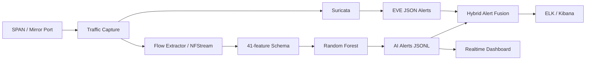

# Hybrid-NIDS: Suricata + Random Forest Network Intrusion Detection

> Hệ thống phát hiện xâm nhập mạng lai (Hybrid Network Intrusion Detection System) kết hợp phát hiện dựa trên luật/chữ ký (Suricata) và phát hiện dựa trên học máy theo đặc trưng luồng mạng (Random Forest).

[]()
[]()
[]()

---

## Giới thiệu

**Hybrid-NIDS** là mã nguồn phục vụ đề án thạc sĩ ứng dụng về hệ thống phát hiện xâm nhập mạng lai, kết hợp hai nhánh phát hiện **độc lập**:

- **Suricata** — phát hiện dựa trên luật/chữ ký (signature-based).
- **Random Forest** — phát hiện dựa trên đặc trưng luồng mạng, tiếp cận flow-based machine learning.

Cảnh báo từ hai nhánh được **dung hợp (fusion)** theo cửa sổ thời gian và đưa vào **ELK Stack/Kibana** để giám sát, phân tích và trình diễn trong môi trường lab.

> **Lưu ý:** Repo này đã được làm sạch để công khai trên GitHub. Môi trường ảo, dữ liệu UNSW-NB15 dung lượng lớn, PCAP thực tế, log vận hành và các file chứa bí mật triển khai **không** được đưa vào repo.

---

## Mục lục

- [Kiến trúc tổng quát](#kiến-trúc-tổng-quát)
- [Điểm chính của codebase](#điểm-chính-của-codebase)
- [Kết quả mô hình chính thức](#kết-quả-mô-hình-chính-thức)
- [Cấu trúc repo](#cấu-trúc-repo)
- [Yêu cầu môi trường](#yêu-cầu-môi-trường)
- [Cài đặt nhanh](#cài-đặt-nhanh)
- [Kiểm tra repo sau khi cài đặt](#kiểm-tra-repo-sau-khi-cài-đặt)
- [Chạy AI inference bằng dữ liệu mẫu](#chạy-ai-inference-bằng-dữ-liệu-mẫu)
- [Chạy dashboard thời gian thực](#chạy-dashboard-thời-gian-thực)
- [Dung hợp cảnh báo Suricata + AI](#dung-hợp-cảnh-báo-suricata--ai)
- [Dataset và tái tạo kết quả](#dataset-và-tái-tạo-kết-quả)
- [PCAP / live traffic](#pcap--live-traffic)
- [Triển khai Ubuntu + ELK](#triển-khai-ubuntu--elk)
- [Bảo mật secret](#bảo-mật-secret)
- [Tài liệu quan trọng](#tài-liệu-quan-trọng)
- [Phạm vi sử dụng](#phạm-vi-sử-dụng)
- [Ghi chú về license](#ghi-chú-về-license)

---

## Kiến trúc tổng quát



Ở tầng thu thập, cùng một nguồn traffic được quan sát từ cổng SPAN/mirror. Ở tầng phát hiện, Suricata và Random Forest hoạt động theo hai cơ chế độc lập. Module `hybrid_alert_fusion.py` thực hiện **tương quan cảnh báo (correlation)** thay vì biến hai nhánh thành một bộ phân loại duy nhất.

---

## Điểm chính của codebase

- Random Forest với pipeline tiền xử lý cho dữ liệu số và dữ liệu phân loại.
- Schema chính thức gồm **41 đặc trưng**, trong đó có 35 đặc trưng số và 6 đặc trưng phân loại.
- Chia **Development / Hold-out** theo feature hash nhằm hạn chế trùng lặp giữa các tập.
- **Group-aware Stratified 5-Fold Cross Validation** để chọn ngưỡng phân loại.
- Kiểm tra leakage, benchmark suy luận, feature importance và confusion matrix.
- Dung hợp cảnh báo Suricata + AI thành `HYBRID_CORRELATED_ALERT`, `AI_ONLY_ALERT`, `SURICATA_ONLY_ALERT`.
- Dashboard replay theo thời gian thực để phục vụ demo.
- Script triển khai Ubuntu, systemd, Logstash, ILM, logrotate và kiểm tra đồng bộ thời gian.
- Kiểm tra SHA-256 trước khi load model pickle/joblib từ vùng artifact tin cậy.

---

## Kết quả mô hình chính thức

> Các giá trị dưới đây được lấy từ `models/metrics.json` trong repo này.

| Chỉ số | Kết quả |
|---|---|
| Accuracy | 0.992768 |
| Balanced Accuracy | 0.984698 |
| Precision | 0.968823 |
| Recall | 0.973911 |
| F1-score | 0.971360 |
| False Positive Rate | 0.004515 |
| False Negative Rate | 0.026089 |
| ROC-AUC | 0.999671 |
| Threshold | 0.870846 |
| Hold-out test size | 508,039 flows |

**Confusion matrix (hold-out test set):**

| | Predicted Negative | Predicted Positive |
|---|---|---|
| **Actual Negative** | TN = 442,060 | FP = 2,005 |
| **Actual Positive** | FN = 1,669 | TP = 62,305 |

Kết quả kiểm tra leakage hiện lưu trong `models/leakage_check.json`: `duplicate_hash_count = 0` và `is_pass = true`.

---

## Cấu trúc repo

```text
HYBRID-NIDS/
├── README.md
├── requirements.txt
├── requirements-optional.txt
├── train_model.py                 # Huấn luyện mô hình chính thức
├── nids_detector.py               # Suy luận AI trên flow CSV / tích hợp PCAP
├── nids_features.py               # Trích xuất đặc trưng luồng
├── hybrid_alert_fusion.py         # Dung hợp Suricata + AI
├── realtime_dashboard.py          # Dashboard replay thời gian thực
├── hybrid_nids_webpanel.py        # Web control panel cho lab
├── verify_official_artifacts.py   # Kiểm tra bộ artifact đầy đủ
├── verify_model_artifacts_security.py
├── benchmark_inference.py
├── analyze_schema_gap.py
├── analyze_feature_drift.py
├── analyze_ttl_features.py
├── evaluate_artifacts.py
├── evaluate_local_traffic.py
├── sample_flows.csv               # Mẫu nhỏ để test inference
├── models/                        # Model + metrics + schema + figures
├── data/                          # Chỉ giữ dữ liệu mẫu/metadata nhỏ
├── logs/                          # Chỉ giữ log mẫu phục vụ fusion
├── docs/                          # Tài liệu kỹ thuật và hướng dẫn tái tạo
├── deployment/                    # systemd, ELK, logrotate, env.example
├── scripts/                       # Script chạy lab/deployment
├── labeling/                      # Mẫu gán nhãn theo attack window
├── evidence_screenshots/          # Bằng chứng kiểm thử/thực nghiệm
└── tools/                         # Tiện ích tạo tài liệu/phụ trợ luận văn
```

Danh sách file/artifact được khóa cho luận văn nằm trong `OFFICIAL_ARTIFACTS.md` và `docs/CODEBASE_LOCK.md`.

---

## Yêu cầu môi trường

### Python

Khuyến nghị dùng **Python 3.12** hoặc **3.13**. Artifact model hiện tại được tạo với:

| Thành phần | Phiên bản |
|---|---|
| Python | 3.13.9 |
| scikit-learn | 1.6.1 |
| pandas | 2.3.3 |
| NumPy | 2.3.5 |

> `scikit-learn` được **pin** ở phiên bản `1.6.1` trong `requirements.txt` để giảm rủi ro không tương thích khi deserialize model.

### Hệ điều hành

| Hệ điều hành | Phù hợp cho |
|---|---|
| **Windows** | Huấn luyện, đánh giá, replay CSV và dashboard |
| **Ubuntu/Linux** | Capture PCAP, NFStream, Suricata, systemd và ELK deployment |

---

## Cài đặt nhanh

### Windows PowerShell

```powershell
git clone https://github.com/<YOUR-USERNAME>/hybrid-nids.git
cd hybrid-nids

py -3.13 -m venv .venv
.\.venv\Scripts\Activate.ps1
python -m pip install --upgrade pip
pip install -r requirements.txt
```

### Ubuntu/Linux

```bash
git clone https://github.com/<YOUR-USERNAME>/hybrid-nids.git
cd hybrid-nids

python3 -m venv .venv
source .venv/bin/activate
python -m pip install --upgrade pip
pip install -r requirements.txt
```

Các tiện ích không thuộc đường chạy chính (ví dụ XGBoost comparison hoặc công cụ chỉnh DOCX) có thể cài thêm bằng:

```bash
pip install -r requirements-optional.txt
```

---

## Kiểm tra repo sau khi cài đặt

**1. Smoke test schema/extractor**

```bash
python smoke_test_schema.py
```

Kết quả mong đợi:

```text
[+] Smoke test schema/extractor OK.
```

**2. Kiểm tra tính toàn vẹn model**

```bash
python verify_model_artifacts_security.py
```

Script kiểm tra model có nằm trong thư mục tin cậy và SHA-256 có khớp metadata trước khi sử dụng hay không.

> ⚠️ **Không load** file `.pkl`/`.joblib` lấy từ nguồn không tin cậy. Pickle/joblib có thể thực thi mã trong quá trình deserialize.

---

## Chạy AI inference bằng dữ liệu mẫu

Repo có sẵn `sample_flows.csv` để kiểm tra nhanh:

```bash
python nids_detector.py \
  --input-csv sample_flows.csv \
  --once \
  --output-log logs/ai_alerts.jsonl \
  --disable-discord \
  --disable-telegram
```

Trên PowerShell:

```powershell
python nids_detector.py `
  --input-csv sample_flows.csv `
  --once `
  --output-log logs\ai_alerts.jsonl `
  --disable-discord `
  --disable-telegram
```

Model chính thức mặc định sử dụng:

- `models/nids_rf_pipeline.pkl`
- `models/metadata.json`
- `models/feature_schema_model.json`

---

## Chạy dashboard thời gian thực

Trên Windows:

```powershell
.\run_realtime_dashboard.ps1
```

Hoặc chạy trực tiếp:

```bash
python realtime_dashboard.py \
  --input-csv sample_flows.csv \
  --host 127.0.0.1 \
  --port 8050
```

Sau đó mở: `http://127.0.0.1:8050`

Dashboard có thể hiển thị số flow đã xử lý, số cảnh báo, alert rate, latency, throughput và các chỉ số live khi input có nhãn.

---

## Dung hợp cảnh báo Suricata + AI

Repo có log mẫu để thử module fusion:

```bash
python hybrid_alert_fusion.py \
  --suricata-eve logs/sample_suricata_eve.jsonl \
  --ai-alerts logs/ai_alerts.jsonl \
  --output logs/hybrid_alerts.jsonl \
  --window-seconds 300 \
  --include-unmatched \
  --max-records 20
```

> Nếu chưa tạo `logs/ai_alerts.jsonl`, hãy chạy bước AI inference trước.

📖 Tài liệu chi tiết: [`docs/HYBRID_FUSION_GUIDE.md`](docs/HYBRID_FUSION_GUIDE.md)

---

## Dataset và tái tạo kết quả

Các file UNSW-NB15 dung lượng lớn **không** được commit vào GitHub. Để tái tạo huấn luyện/đánh giá đầy đủ, cần chuẩn bị bộ dữ liệu cục bộ theo cấu trúc mà codebase yêu cầu, đặc biệt:

```text
UNSW_NB15_Splitted_CLEAN/
├── unsw_nb15_train_full.csv
├── unsw_nb15_test_holdout.csv
├── clean_split_summary.json
└── label_conflict_groups.csv
```

Sau khi dữ liệu đã có đúng vị trí, có thể chạy:

```bash
python check_leakage.py
python train_model.py
python benchmark_inference.py
python evaluate_artifacts.py
python verify_official_artifacts.py
```

> `verify_official_artifacts.py` là kiểm tra cho bộ hồ sơ thực nghiệm đầy đủ, nên sẽ báo thiếu file nếu bạn clone bản GitHub nhưng chưa đặt dataset lớn vào máy.

📖 Hướng dẫn tái tạo chi tiết: [`docs/REPRODUCIBILITY_GUIDE.md`](docs/REPRODUCIBILITY_GUIDE.md)

---

## PCAP / live traffic

Nhánh PCAP/NFStream được dùng cho tích hợp và kiểm thử live. Codebase đồng thời lưu một nghiên cứu giảm schema trong `models/rf21_schema_gap/`.

Cần phân biệt rõ:

- Metrics chính thức trong `models/metrics.json` được đánh giá trên hold-out dataset theo schema 41 đặc trưng.
- Kết quả trên traffic thực tế **không nhãn** chỉ là kiểm tra vận hành, **không được diễn giải** thành Accuracy/Precision/Recall/F1.
- Khi schema extractor live chưa tương đương schema huấn luyện, **không được xem** kết quả PCAP là tương đương với kết quả hold-out.

Xem thêm:
- [`docs/RF21_NFSTREAMER_RETRAIN_EVAL.md`](docs/RF21_NFSTREAMER_RETRAIN_EVAL.md)
- [`docs/MINI_LIVE_TEST_RF21_GUIDE.md`](docs/MINI_LIVE_TEST_RF21_GUIDE.md)
- [`models/schema_gap_report.md`](models/schema_gap_report.md)

---

## Triển khai Ubuntu + ELK

Các file chính:

```text
deployment/
├── hybrid-nids.env.example
├── systemd/
├── elk/
│   ├── docker-compose.yml
│   ├── ilm/
│   └── logstash/pipeline/
├── logrotate/
└── tmpfiles/
```

> ⚠️ **Không** chỉnh trực tiếp `hybrid-nids.env.example` để chứa secret thật. Hãy tạo bản cục bộ:

```bash
cp deployment/hybrid-nids.env.example deployment/hybrid-nids.env
```

Sau đó điền mật khẩu/token trên máy triển khai. `deployment/hybrid-nids.env` đã được `.gitignore` loại khỏi Git.

📖 Hướng dẫn: [`docs/UBUNTU_DEPLOYMENT_GUIDE.md`](docs/UBUNTU_DEPLOYMENT_GUIDE.md) và [`docs/TIME_SYNC_GUIDE.md`](docs/TIME_SYNC_GUIDE.md)

---

## Bảo mật secret

**Không commit** các thông tin sau:

- Elasticsearch password
- Kibana system password
- Discord webhook
- Telegram bot token/chat ID
- Web panel password
- PCAP hoặc log thu từ mạng thật có dữ liệu nhạy cảm

Repo chỉ giữ `deployment/hybrid-nids.env.example` với placeholder.

> ⚠️ Nếu một secret thật từng được commit vào Git trước đây, chỉ thêm vào `.gitignore` là **chưa đủ**. Cần **thu hồi/rotate** secret đó và **xóa khỏi lịch sử Git** trước khi public repository.

---

## Tài liệu quan trọng

| Tài liệu | Mục đích |
|---|---|
| [`OFFICIAL_ARTIFACTS.md`](OFFICIAL_ARTIFACTS.md) | Danh sách artifact chính thức |
| [`docs/CODEBASE_LOCK.md`](docs/CODEBASE_LOCK.md) | Khóa contract của codebase |
| [`docs/REPRODUCIBILITY_GUIDE.md`](docs/REPRODUCIBILITY_GUIDE.md) | Tái tạo thực nghiệm |
| [`docs/RESULTS_SUMMARY.md`](docs/RESULTS_SUMMARY.md) | Tổng hợp kết quả |
| [`docs/HYBRID_FUSION_GUIDE.md`](docs/HYBRID_FUSION_GUIDE.md) | Dung hợp cảnh báo |
| [`docs/LOCAL_TRAFFIC_EVALUATION_GUIDE.md`](docs/LOCAL_TRAFFIC_EVALUATION_GUIDE.md) | Đánh giá traffic cục bộ |
| [`docs/TIME_SYNC_GUIDE.md`](docs/TIME_SYNC_GUIDE.md) | Đồng bộ thời gian phục vụ correlation |
| [`docs/UBUNTU_DEPLOYMENT_GUIDE.md`](docs/UBUNTU_DEPLOYMENT_GUIDE.md) | Triển khai Ubuntu |

---

## Phạm vi sử dụng

Codebase phục vụ **nghiên cứu, đào tạo và kiểm thử phòng lab**. Chỉ thực hiện capture, scanning hoặc mô phỏng tấn công trên hệ thống mà bạn **có quyền quản trị** hoặc **được phép kiểm thử**.

---

## Ghi chú về license

Bản repo này **chưa** tự động gán giấy phép nguồn mở. Trước khi công khai và cho phép bên thứ ba tái sử dụng mã nguồn, nên bổ sung một file `LICENSE` phù hợp với chính sách của tác giả/cơ sở đào tạo.

---

<p align="center"><sub>Hybrid-NIDS — Đề án thạc sĩ về Hệ thống phát hiện xâm nhập mạng lai</sub></p>
